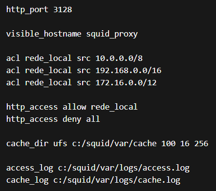
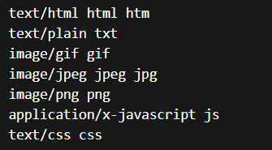
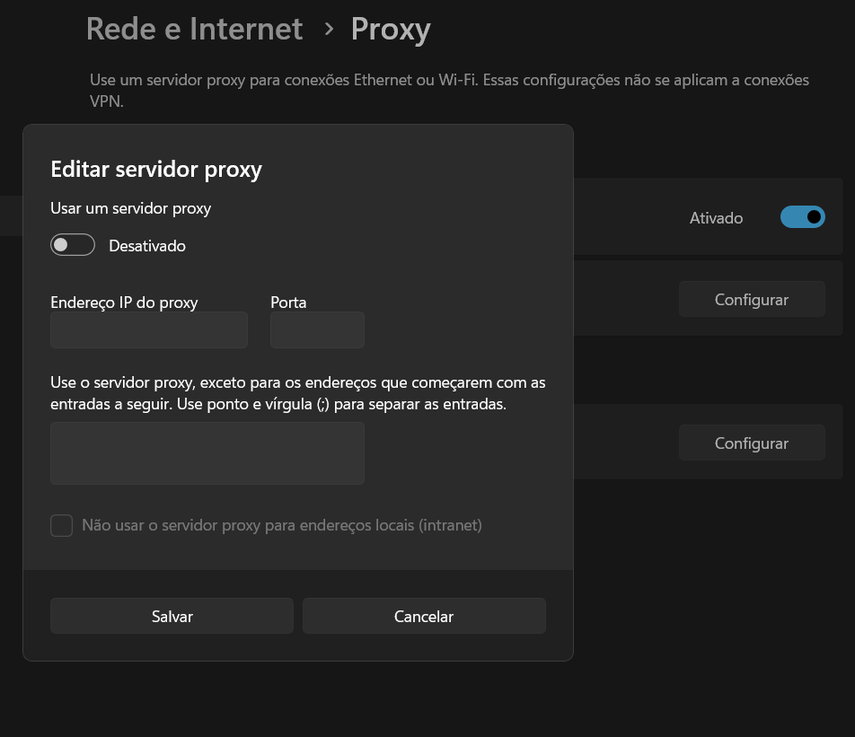
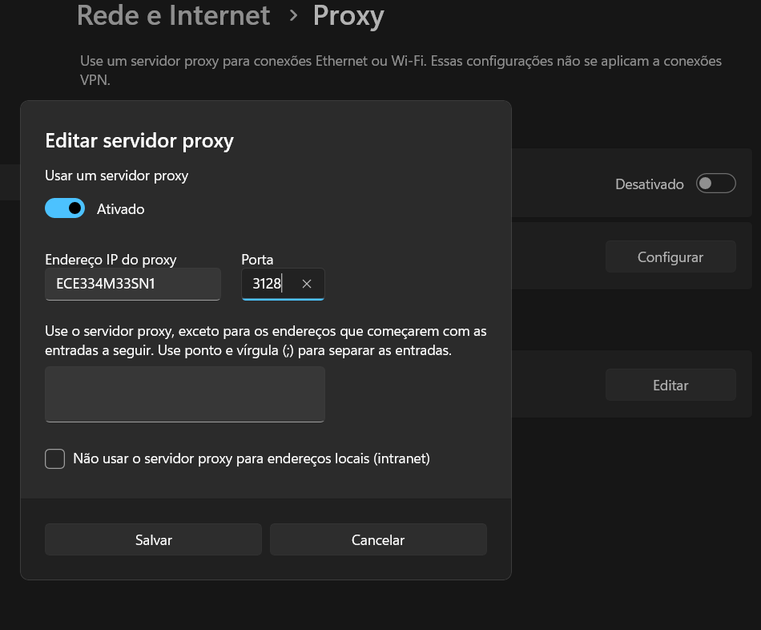
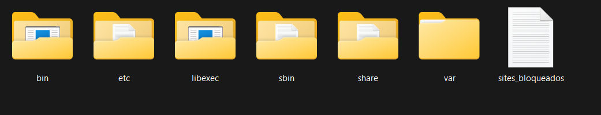
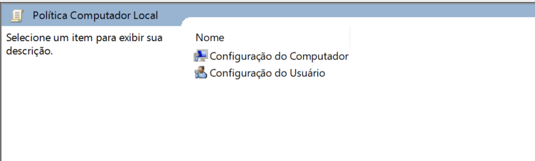
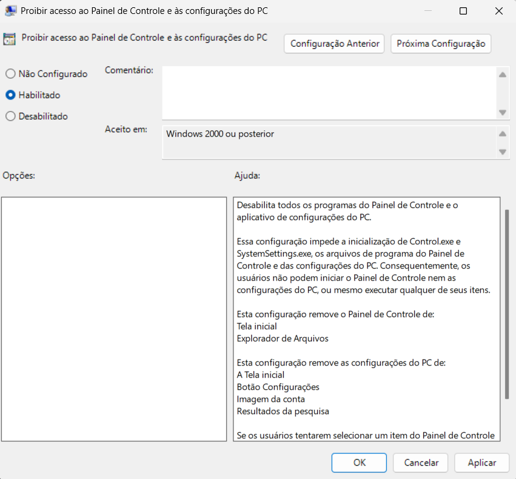
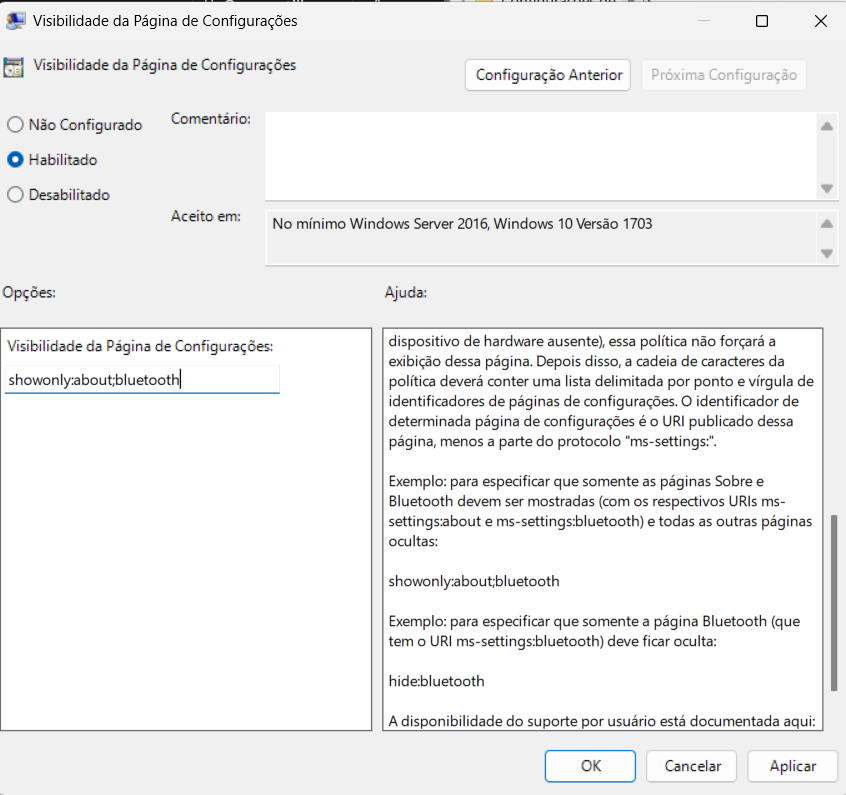
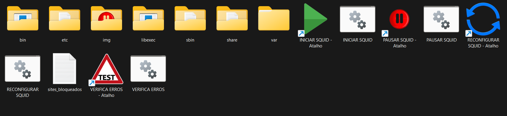

# SQUID CONFIGURAÇÃO 
PASSO A PASSO PARA CONFIGURAÇÃO DO SQUID NO WINDOWS 11
DESCOMPACTE ESTA PASTA NA RAIZ DO COMPUTADOR (C:)
LOGO APÓS, SIGA OS PASSOS ABAIXO.

---

C:\squid
     
│
├── bin
├── etc
├── libexec
├── sbin
├── share
├── var

Estrutura básica.

### 1️⃣ `bin`

Contém executáveis principais.

### 2️⃣ `etc` ⭐ (uma das mais importantes)

Aqui ficam **os arquivos de configuração**.

---

### 3️⃣ `libexec`

Arquivos auxiliares usados pelo Squid.

### 4️⃣ `sbin`

Executáveis administrativos.

---

### 5️⃣ `share`

Arquivos auxiliares e de suporte.

### 6️⃣ `var` ⭐ (muito importante)

Aqui ficam **logs e cache**.

---

## 1. PASSO

Criar as pastas cache e logs dentro da pasta var.
var
 |-cache
 |-logs
 
---

## 2. PASSO

Utilizando o bloco de notas você deve criar o arquivo squid.conf dentro da pasta **etc.**

Depois crie o arquivo mimo.conf também na pasta **etc.**

### Conteúdo do arquivo squid.config

### Conteúdo do arquivo mimo.config

> EXPLICAÇÃO LINHA A LINHA
> 
1. O Squid vai **escutar conexões HTTP** na porta **3128**.
2. Define o **nome do servidor proxy**.
3. Cria uma acl chamada all (TODOS OS IPS).
4. Cria uma acl chamada rede_local com ip da rede.
5. Regra de acesso http_access allow.
6. Regra de bloqueio html_access deny.
7. Define onde o squid guarda o conteúdo cacheado da internet.
    
    Ufs = tipo de sistema de cache
    
    100 = tamanho de cache em MB
    
    16 = número de diretórios de primeiro nível
    
    256 = número de diretórios de segundo nível
    
8. Define onde salvar o log de acesso dos usuários.
9. Define o log interno do Squid.

---

## 3. PASSO

Se as pastas cache e log não existirem, você deve criar.

C:\squid\var\cache
C:\squid\var\logs

---

## 4. PASSO

Abra **Prompt como administrador** e rode:

cd C:\squid\sbin
squid -z

Se der certo aparecerá a mensagem: 

Creating Swap Directories

---

## 5. PASSO

Agora execute o squid.

C:\squid\sbin>squid

---

## 6. PASSO

No computador cliente. Versão Windows 11.

Configurações → Rede e Internet → Proxy → Desative Detectar configurações automaticamente.

Configuração de Proxy manual → Usar um servidor proxy → Configurar → Ative a opção Usar um servidor proxy.

Em Endereço IP do proxy insira nome da máquina servidor exemplo ECE334M33SN1 → Porta: 3128.

---

## 7. PASSO

Crie o arquivo sites_bloqueados.txt dentro da pasta Squid.

O arquivo sites_bloqueados.txt deve conter a lista de sites que serão bloqueados.

dstdomain "c:/squid/sites_bloqueados.txt bloqueia todos as extensões do site.

dstdomain = domínio de destino

facebook.com

www.facebook.com

m.facebook.com

---

## 8. PASSO

Acessar gpedit.msc como Administrador.

Configuração do Usuário 

→ Modelos Administrativos 

→ Painel de Controle

→ Proibir acesso ao painel de Controle e às configurações do PC

→ Visibilidade da Página de Configurações

---

## 9. PASSO

O arquivo sites_bloqueados.txt tem todos os sites bloqueados.

Para bloquear um site você deve inserir seu domínio exemplo: 

.facebook.com

.instagram.com

Para comentários dentro do arquivo sites_bloqueados.txt você deve utilizar # no inicio da linha.

O Computador servidor  deve clicar em INICIAR SQUID toda vez que for ligado.

Caso algum problema aconteça clicar em PAUSAR SQUID e depois em INICIAR SQUID.

O Reconfigurar deve ser rodado toda vez que você fizer alguma alteração no arquivo sites_bloqueados.txt
